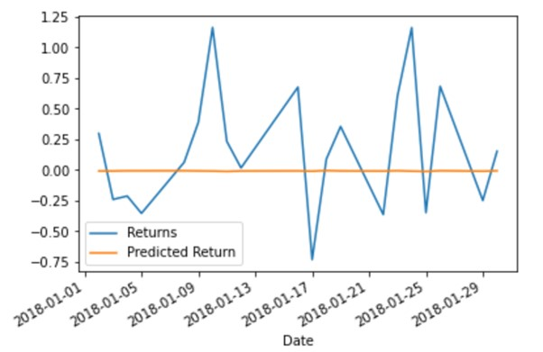

# Week_10_Assignment

# Time Series
## Historical Yen Futures Data

The data from 1990 to 2020 shows an overall increase: almost linear, with 2-3 year periods of volatility where value increase significantly then dops back to a value higher than it was prior to the rise/fall.

## Conclusions
### Questions
Based on your time series analysis, would you buy the yen now?
Is the risk of the Yen expected to increase or decrease?
Based on the model evaluation, would you feel confident in using these models for trading?

### Analysis and Conclusions
The ARMA model of 5 Day Returns shows a drop on the first day then increasing for the following 4 days  but the P values are >0.05 indicating inaccuracy in the model.

In the Arima model 5 Day model forecasts increasing value for Yen futures .  However parameters have a P value >0.05 so it is therefore not an accurate model.

GARCH modelling of volatility and 5 Day Forecast has a Beta=0 and Alpha(1)=1.4-e05 suggesting it is a good model of the risk/volatility of the Yen. The model predicts a moderate increasing risk with the 5 Day Yen forecast .

Confidence in using the models is moderate to low, but based on the results of the modeling and forecasting, I would buy Yen as the Arima and Arma models, although somewhat inaccurate, shows an increase in value over the forecasted period. However the risk, modelled with a high degree of accuarcy, increases with time, therefore the investment needs to be closely monitored. 

# Regression Analysis
## Seasonal Effects with Sklearn

A plot of the predicted vs Actual Returns over the modleed period shows that there is poor correlation with the 2 : the predicted being several magnitudes different to actual returns.

The Root Mean Square Error (RMSE) of the Out-of- Sample Performance is 0.415483
The RMSE of the In-Sample Performance is ).596366

The model does not appear to be doing very well based on the plot shown above and that both the In-Sample and Out-of-Sample RMSE are high and  similar. Indded the In-Sample RMSE, which should be lower, is in this case higher than the Out-of Sample RMSE.

